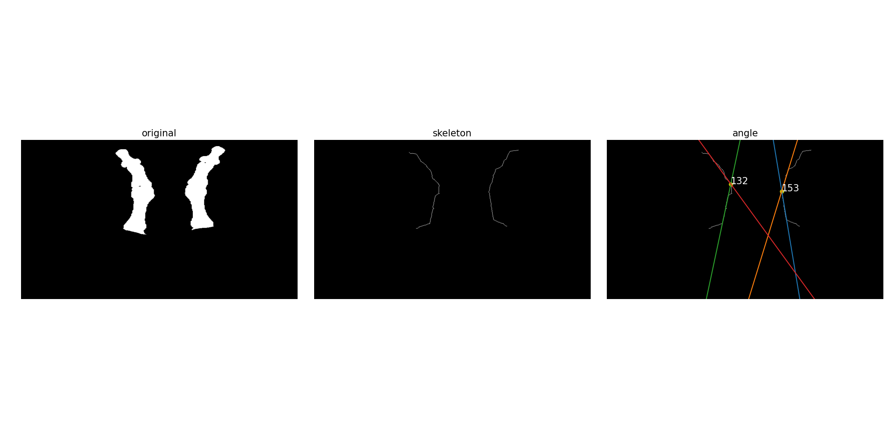

# Hallux skeleton estimation

## Usage

```bash
python skeleton_angle.py --input <file or diectory> [--output <file or diectory>]
````

## Example

```bash
python skeleton_angle.py --input data/unet_mask_devel_big_toe_aspect_ratio/img_0041.png --output out/result_img_0041.png
```

### Results


